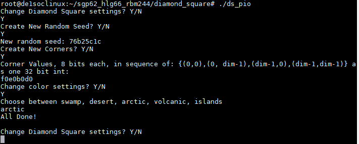
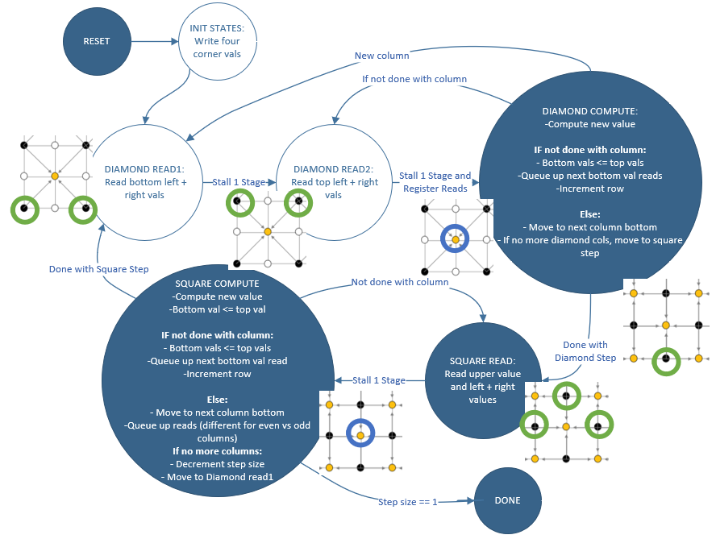
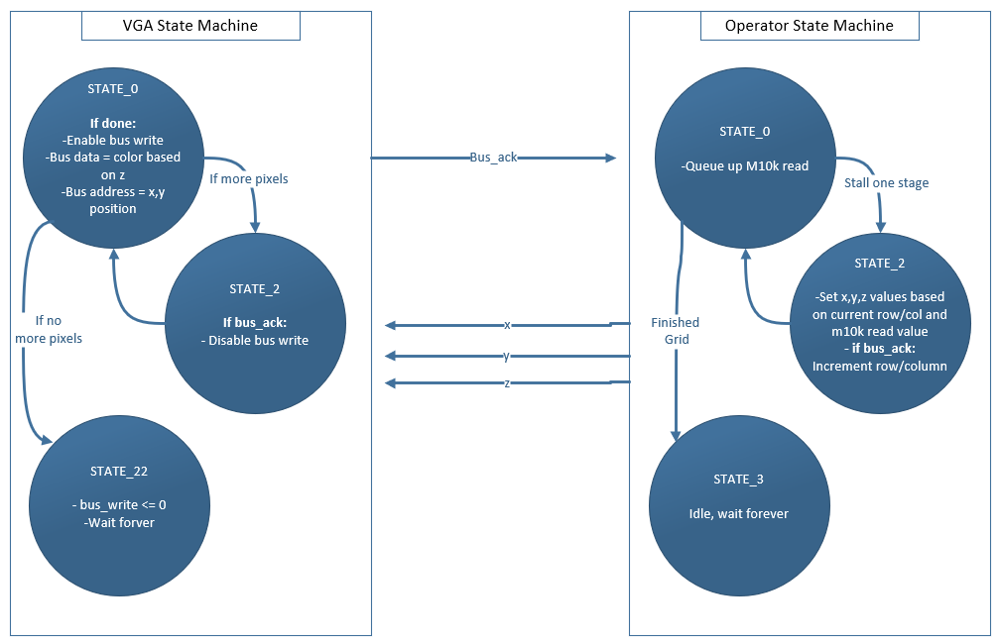
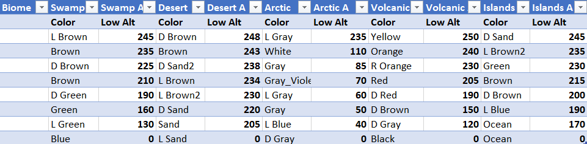
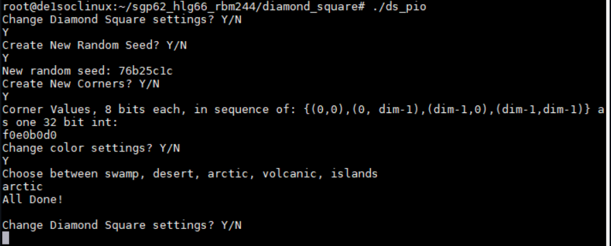

## Welcome to GitHub Pages

You can use the [editor on GitHub](https://github.com/sgp62/ECE5760/edit/gh-pages/index.md) to maintain and preview the content for your website in Markdown files.

Whenever you commit to this repository, GitHub Pages will run [Jekyll](https://jekyllrb.com/) to rebuild the pages in your site, from the content in your Markdown files.

### Markdown

Markdown is a lightweight and easy-to-use syntax for styling your writing. It includes conventions for

```markdown
Syntax highlighted code block

# Header 1
## Header 2
### Header 3

- Bulleted
- List

1. Numbered
2. List

**Bold** and _Italic_ and `Code` text

[Link](url) and 



```
### **Hardware Design**

_Translating Diamond Square to the FPGA_

To initially lay out the diamond square algorithm to get a sense of its steps, we implemented it in python. The translation to Verilog required a state machine to move through the Diamond and Square steps, combined with M10k memory storage for each column of the map. Since the DE1-SoC caps at ~390 M10k blocks, and the Diamond Square algorithm requires map dimensions of (2n+1, 2n+1), our largest map would be (257,257). 

Initially we attempted a parallel approach where separate solvers would fill their own M10k block and pass values to adjacent columns, but we ran out of ALMs with this approach (maxing out at a 33x33 map). Our final implementation was a serial solver that executed parallel M10k reads and computed the values one at a time. The RTL for this single solver can be found [here](https://github.com/sgp62/ECE5760/blob/main/FinalProject/ds_single_operator.v) . The state machine for this implementation took the following shape:


_Figure X: Single Solver State Machine, with illustrative images to show reads (Green) and writes (Blue) at specific steps_

Illustrated by the above diagram, the single solver moves back and forth between the diamond and square steps, performing all of the diamond step calculations for all rows/columns at the given step size (depth), followed by all of the square step calculations for all rows/columns at the same depth. Each computation requires four reads to compute the weighted point average with added randomness for the altitude at a given point. Once all diamond and square steps are computed at this depth, the step_size decreases by a factor of two and the state machine is run again, eventually until all values on the board have been filled. Not pictured in the state machine diagram are specific stall stages for M10k read latency/register loading; only the algorithmic logic states are pictured. 
Once the step_size reaches 1 and the square step finishes, we have finished the entire board, and enter the done state, where the values are written to the VGA screen for display. 


_Communicating with the VGA Screen_

Once the diamond square landscape grid is computed and stored in M10k blocks, we need a way to display the generated data onto the VGA screen, with relevant colors to properly display the landscape. Initially, we experimented with writing values directly to VGA synthesized SRAM, allowing one VGA write every cycle. However, this created issues when we attempted to scale up our maps to larger sizes since the VGA synthesized SRAM uses M10k blocks in addition to the columns of the generated map. To mitigate this, we implemented a bus master that writes to VGA SDRAM, trading slower VGA writes for more M10k design space. We saw this as a valuable tradeoff given that we weren’t designing for any speed constraints; we only considered area constraints for our design to generate the largest map. The process of writing to the VGA screen involves a bus master state machine and a state machine in the diamond square operator, working together to pass values to the VGA in the following manner, where both state machines stay idle until all M10k blocks are filled by the solver state machine, and begin once that finishes:


_Figure X: VGA Write State Machine working with Diamond Square Output State Machine_

The operator produces the x,y (column,row) coordinates along with the z value (altitude) that was stored in the M10k block at that x,y position and outputs these to the top level module that reads them in. The VGA state machine uses the x and y position to create the SDRAM bus address, and the z coordinate is used to determine the color for the bus write data. We used 8 bit color for our landscape generation, and each landscape biome has 8 colors with their own altitude thresholds (see Software Design section). Once all of the SDRAM pixels have been written, both state machines stay idle until another reset. The RTL for the top level design can be found here. 


_Randomness with LFSR_

When calculating the height for a given point on the diamond square grid, a random value is added to the four-point average from the adjacent points. In order to create randomness on the FPGA, we utilized a 64 bit Linear Feedback Shift Register with 16 bit output, which uses a set of XOR gates to create a spanning set of all values in the 64 bit space, with one new value shifted in every cycle as the output of the XOR function.


_Figure X: Example of a 16 bit LFSR_

In our implementation, we take a random 32 bit seed from the HPS (See Parallel IO Ports section) and use this seed to create seeds for 16 other LFSRs. We then assign LFSR outputs to specific columns of the grid for use in that column’s random calculations. The 8 bit random number is added to the result of the 4-point average, accounting for overflow. Each time step_size decreases (meaning we move to a lower fractal depth), fewer bits of this random value are used in the four-point average, to create more homogeneity in the eventual landscape. 

### **Software Design**

_Parallel IO Ports (QSys)_

For this project, the HPS had a minimal role of generating random seeding and initial corner values for the grid, as well as switching between biomes and sending the corresponding color palette to the FPGA over a parallel IO port. Our Qsys setup for the project was as follows:


_Figure X: Qsys Declarations for Diamond Square Project_

Notable on our Qsys bus was the Bus_master_video, which we used to interface with the VGA SDRAM and write our screen pixels. Important in our design for this bus master was the correct memory base for the SDRAM, which is listed at 0x0 in Qsys. This ensured we were writing to the correct memory locations with our bus master. 

As mentioned in the Randomness with LFSR section, the random seed was passed as a 32 bit value which was duplicated as the input to the LFSR synthesized on the FPGA. The user also can change the initial corner values of the grid with the pio_corners port. For color and altitude, two 32 bit ports were used, with the color port partitioning the two ports into 8 separate 8-bit colors, and the altitude ports partitioning the ranges of altitude corresponding to those colors. For our 5 biomes (swamp, desert, arctic, volcanic, islands), the colors and altitude thresholds were as follows:


_Figure X: Colors per Biome and corresponding lower bound Altitudes for each_

These 5 configurations were stored in 32 bit integers on the HPS, and the UI enabled selecting and switching between them; showing the altered biome with a reset on the FPGA as the color and altitude thresholds were passed over a PIO port to the FPGA. The FPGA reads this PIO input when selecting values for the color_reg which eventually becomes the SDRAM bus write data.


_Color Selector Interface_

During our demo and during testing of our system, we created a simple user interface running in MobaXTerm for configuring the landscape generation.


_Figure X: HPS User Interface for changing the landscape_

This interface had three basic functions: setting a new random seed, changing the value of the four corners, and switching to a different biome. The user responses were captured with scanf from the command line. In the above image, the user creates a new random seed (0x76b25c1c), creates four new corner values (f0e0b0d0) where each set of 8 bits is one corner, and switches to the arctic biome. Each of these parameter changes is observable on the VGA screen after a KEY0 press on the FPGA. 


<!-- For more details see [Basic writing and formatting syntax](https://docs.github.com/en/github/writing-on-github/getting-started-with-writing-and-formatting-on-github/basic-writing-and-formatting-syntax).

### Jekyll Themes

Your Pages site will use the layout and styles from the Jekyll theme you have selected in your [repository settings](https://github.com/sgp62/ECE5760/settings/pages). The name of this theme is saved in the Jekyll `_config.yml` configuration file.

### Support or Contact

Having trouble with Pages? Check out our [documentation](https://docs.github.com/categories/github-pages-basics/) or [contact support](https://support.github.com/contact) and we’ll help you sort it out. -->
